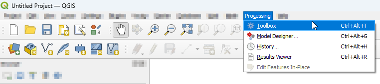

Processing Tools
================

Some of AequilibraE's plugin functionalities are now available in a Processing plugin.
The processing plugin is automatically installed with AequilibraE, and allows the user to 
create projects from links, export matrices, and much more. The processing plugin usage
does not require open AequilibraE projects, although it is mandatory to have AequilibraE
installed.

To find AequilibraE's processing plugin, click on the **Processing** panel and select **Toolbox**.
You can also use the available QGIS shortcut to open the Toolbox window. 

At the bottom of the window, you'll find the AequilibraE logo, and the available functions. 
The functions are divided into three groups, following the same logic as the AequilibraE Widget
menu. Notice that not all AequilibraE's functionalities are available for processing.

.. subfigure:: AB
    :align: center

    .. image:: ../images/processing_provider_toolbox-1.png
        :alt: Toolbox General

    .. image:: ../images/processing_provider_toolbox-2.png
        :alt: Toolbox Detailed

In the following subsections, we'll go over all functionalities.

Data 
----
Export matrices
~~~~~~~~~~~~~~~

The *Export matrices* tool is analogous to the 

Import matrices
~~~~~~~~~~~~~~~

Model Building
--------------
Add centroid connectors
~~~~~~~~~~~~~~~~~~~~~~~

Create project from layer
~~~~~~~~~~~~~~~~~~~~~~~~~

Nodes from centroid
~~~~~~~~~~~~~~~~~~~

Paths ans assignment
--------------------
Traffic assignment from file
~~~~~~~~~~~~~~~~~~~~~~~~~~~~