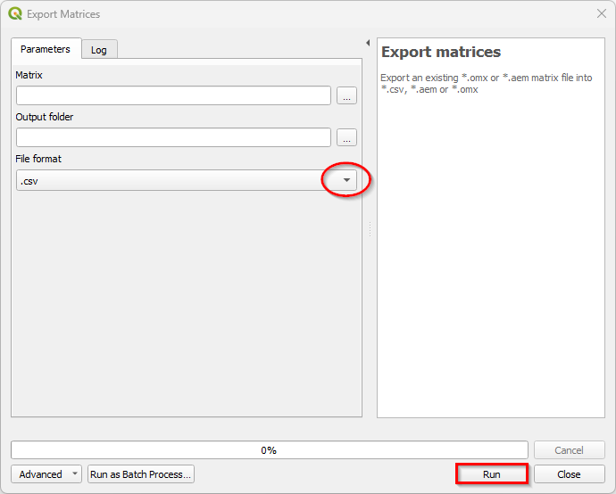
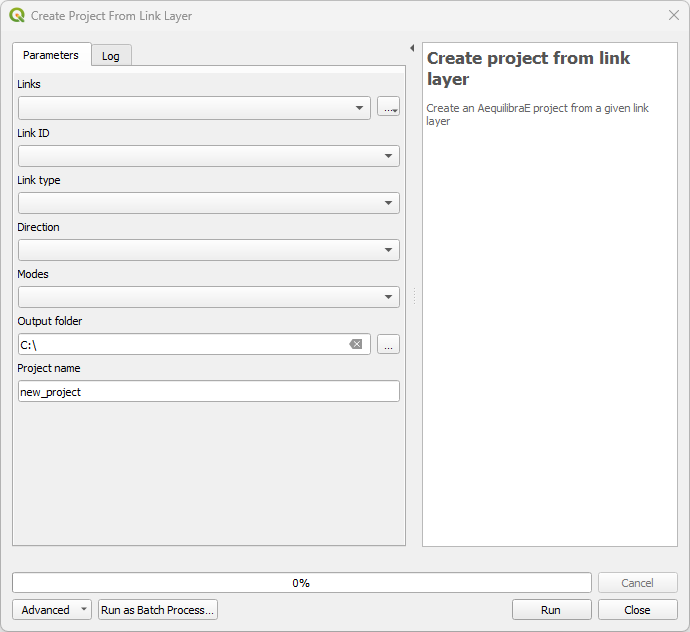
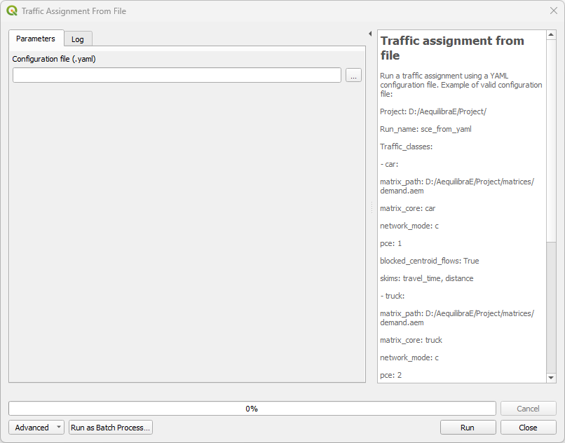

Processing Tools
================

Some of AequilibraE's plugin functionalities are now available in a Processing plugin.
The processing plugin is automatically installed with AequilibraE, and allows the user to 
create projects from links, export matrices, and much more. The processing plugin usage
does not require open AequilibraE projects, although it is mandatory to have AequilibraE
installed.

To find AequilibraE's processing plugin, click on the **Processing** panel and select **Toolbox**.
You can also use the available QGIS shortcut to open the Toolbox window. 

.. image:: ../images/processing_provider_init.png
    :align: center
    :alt: Processing provider menu

At the bottom of the window, you'll find the AequilibraE logo, and the available functions. 
The functions are divided into three groups, following the same logic as the AequilibraE Widget
menu. Notice that not all AequilibraE's functionalities are available for processing.

.. subfigure:: AB
    :align: center

    .. image:: ../images/processing_provider_toolbox-1.png
        :alt: Toolbox General

    .. image:: ../images/processing_provider_toolbox-2.png
        :alt: Toolbox Detailed

In the following subsections, we'll go over all functionalities.

Data 
----
Export matrices
~~~~~~~~~~~~~~~
The *Export matrices* tool is analogous to the *Export* button in the matrix viewer 
(see: :ref:`this figure <fig_data_visualize_loades_matrices>` for more details). 
Its usage is straightforward: select the matrix we want to export, point the path
in our machine to store the file, and select its output format. Only \*.aem and \*.omx files can 
be used as input, and the output format can be either one of \*.aem, \*.omx, or \*.csv.

Import matrices
~~~~~~~~~~~~~~~
With *Import matrices* the user can save an open data layers directly as \*.aem file. 
This tool is analogous to the widget menu :ref:`importing_matrices`, however it does not
require an open AequilibraE project to work. To use the tool, the user must have an open layer
loaded in QGIS, and the menus are the ones presented in the figure below.

.. FIGURE

The upper fields are mandatory, and are the ones responsible for selecting the layer, point
which columns are equivalent to the origin, destination, and the flow, create a file name, and
point the destination folder. In the *Advanced Parameters*, the user will find fields to add
extra informations on the AequilibraE matrix they're about to create.

Model Building
--------------
Add centroid connectors
~~~~~~~~~~~~~~~~~~~~~~~

Create project from link layer
~~~~~~~~~~~~~~~~~~~~~~~~~~~~~~
*Create project from link layer* is similar to the widget menu 
:ref:`Create project from layers <project_from_layers>`, and allows the user to create an AequilibraE 
project straight from a link layer, without requiring a node layer. With a geometric layer loaded into
QGIS, 

Nodes from centroid
~~~~~~~~~~~~~~~~~~~

Paths ans assignment
--------------------
Traffic assignment from file
~~~~~~~~~~~~~~~~~~~~~~~~~~~~

.. code-block:: yaml
    :caption: YAML configuration example

    Project: D:/AequilibraE/Project/

    Run_name: sce_from_yaml

    Traffic_classes:
        - car:
            matrix_path: D:/AequilibraE/Project/matrices/demand.aem
            matrix_core: car
            network_mode: c
            pce: 1
            blocked_centroid_flows: True
            skims: travel_time, distance
        - truck:
            matrix_path: D:/AequilibraE/Project/matrices/demand.aem
            matrix_core: truck
            network_mode: c
            pce: 2
            fixed_cost: toll
            vot: 12
            blocked_centroid_flows: True

    Assignment:
        algorithm: bfw
        vdf: BPR2
        alpha: 0.15
        beta: power
        capacity_field: capacity
        time_field: travel_time
        max_iter: 250
        rgap: 0.00001